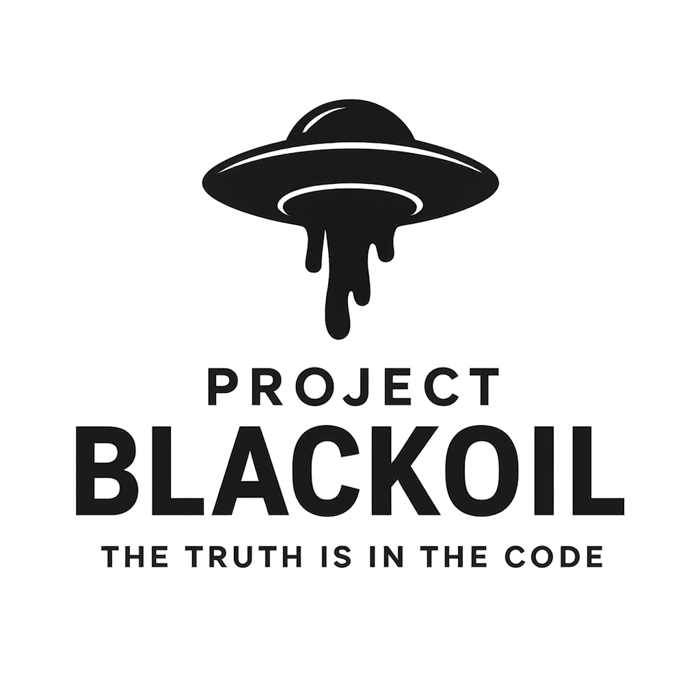

# 🛸 Project BlackOil

> *"The Truth is in the Code"*

**A mysterious AI homelab stack inspired by the iconic black oil from The X-Files - your gateway to experimenting with artificial intelligence.**



---

## 🎯 The Conspiracy

Just like the mysterious black substance from The X-Files, **BlackOil** is the hidden foundation for your AI experiments: powerful, versatile, and shrouded in mystery. 

> *"As the black oil harbored alien life, BlackOil harbors the future of artificial intelligence in your homelab."*

## ✨ Features

### 🚀 **One-Command Deployment**
```bash
ansible-playbook docker-install.yml --ask-become-pass
# or
docker compose -f /opt/blackoil-stack/docker-compose.yml up -d
```

### Included services
- Portainer (Docker GUI)
- Prometheus + Node Exporter (monitoring)
- Grafana (dashboards)
- Postgres + pgAdmin
- TypeMill (CMS)
- Open-WebUI (local LLM frontend)
- Ollama (local LLM runtime)
- JupyterLab (notebook server)
- Optional NVIDIA GPU support for compatible hosts

### Notable additions (updated)
- JupyterLab with optional GPU support (NVIDIA variables wired; device_requests removed for broad compose compatibility).
- Open-WebUI presets: bundled presets to auto-configure Ollama and Jupyter endpoints.
- Brave Search provider preset for Open-WebUI (mountable presets file).
- Auto-generated default password (UUID) available as ansible var `default_password`.
- Daily SMB sync cron example to back up the project directory.
- Ansible playbook installs nvidia-container-toolkit when available and ensures compose is present.

## ⚙️ Quick config pointers

- Jupyter
  - Exposed on port configured by `jupyter_port` (default 8888).
  - Token set via `jupyter_token` or falls back to `default_password`.
  - GPU: the compose template sets NVIDIA env vars; if your host supports Compose device_requests you may enable GPU allocation — otherwise use the nvidia runtime.

- Open-WebUI
  - Presets are mounted from `./webui/presets/presets.json`.
  - Env vars set in compose: `OLLAMA_BASE_URL`, `OLLAMA_DEFAULT_MODEL`, `JUPYTER_URL`, `JUPYTER_TOKEN`, and `BRAVE_SEARCH_URL`.
  - If your Open-WebUI image requires a different schema for presets, adapt `webui/presets/presets.json`.

- Brave Search preset
  - Query URL: `https://search.brave.com/search?q=%s`
  - Add to `webui/presets/presets.json` to expose Brave as a search provider inside the UI.

## 🔐 Passwords & secrets
- `default_password` is generated in the playbook with `lookup('pipe','uuidgen')`.
- To print the generated password during the playbook run:
  - Add the debug task (already included): `- debug: msg="Default password: {{ default_password }}"`
  - To avoid leaking secrets, mark tasks `no_log: true` where appropriate.

## 🛠 Troubleshooting
- Compose validation errors (e.g. `device_requests` not allowed): upgrade Docker Compose or remove unsupported keys from the template.
- Duplicate YAML keys: ensure the jupyter service block has a single `deploy` or no `deploy` section.
- If GPU not visible: verify `nvidia-container-toolkit` is installed and Docker restarted.

## 🧭 Where things live
- Playbook: docker-install.yml
- Templates: templates/docker-compose.yml.j2
- Project root (deployed): /opt/blackoil-stack
- WebUI presets: ./webui/presets/presets.json

## 📣 Final notes
This README documents the recent additions: Jupyter + GPU considerations, Open-WebUI presets (Ollama, Jupyter, Brave Search), generated default password, and SMB backup automation. Re-run the Ansible playbook after editing templates or presets to apply changes.